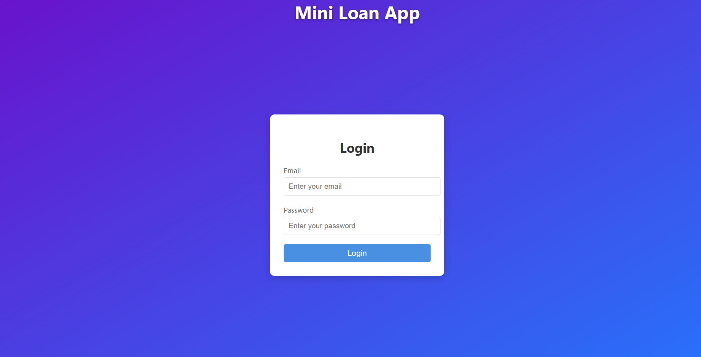
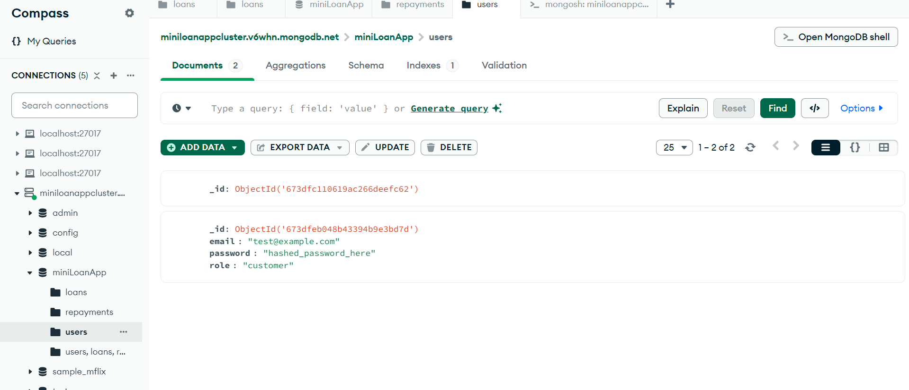
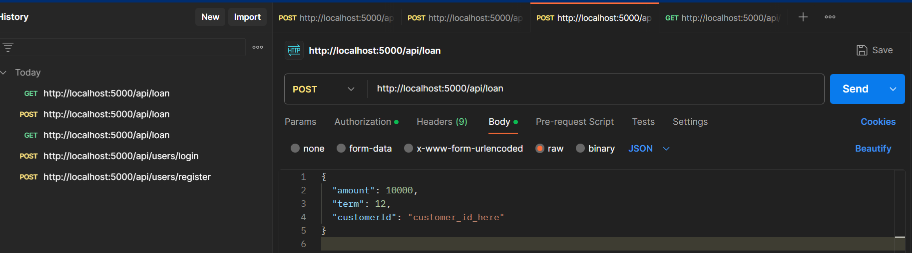
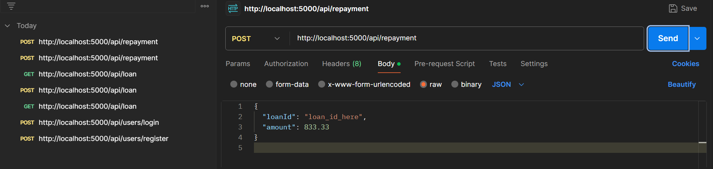

# Mini Loan App

The **Mini Loan App** is a full-stack application designed to manage loan processing and repayments. This project includes user authentication, loan creation, viewing loans, and repayment handling. It utilizes MongoDB Compass, Express.js, React.js, and tools like Postman for API testing.

## Features

- User authentication using **JWT** (JSON Web Tokens).
- Loan creation with scheduled repayments.
- Viewing all loans for a specific user.
- Adding repayments to loans and marking installments as paid.
- Admin functionality for approving loans.

## Table of Contents

1. [Technologies Used](#technologies-used)
2. [Frontend Development](#frontend-development)
3. [Backend Development](#backend-development)
4. [Database Setup](#database-setup)
5. [API Endpoints](#api-endpoints)
6. [How to Run](#how-to-run)
7. [Screenshots](#screenshots)

## Technologies Used

- **Frontend**: React.js, Axios, CSS
- **Backend**: Node.js, Express.js, JWT
- **Database**: MongoDB (MongoDB Atlas/Compass)
- **Tools**: Postman, MongoDB Compass, Git

## Frontend Development

### 1. Setup React App

- Initialized a React app using:
  ```bash
  npx create-react-app mini-loan-app

Created essential components:
Login.js: For user authentication.
LoanRequest.js: For requesting loans.
Configured React Router for navigation.

2. Login Page
Built a Login Page that collects user credentials and authenticates them with the backend.



Backend Development
1. Setting Up the Environment
Initialized a Node.js project: npm init -y
npm install express mongoose bcryptjs jsonwebtoken dotenv
Created the following key files:
server.js: Main server file.
routes/userRoutes.js: For user authentication.
routes/loanRoutes.js: For loan and repayment management.

User Authentication
Implemented user registration and login routes with password hashing using bcryptjs.
Generated JWT tokens for authenticated access to protected routes.



3. Loan Management
Created routes for:
Loan creation: POST /api/loan
Viewing loans: GET /api/loan
Approving loans: PUT /api/loan/:id/approve
Adding repayments: POST /api/repayment

Database Setup
1. MongoDB Atlas
Connected the backend to a MongoDB Atlas cluster using: MONGO_URI=mongodb+srv://<username>:<password>@cluster0.mongodb.net/miniLoanApp

Created collections:
users: To store user credentials.
loans: To store loan details and repayment schedules.
repayments: To track individual repayments.

API Endpoints
Method	Endpoint	Description
POST	/api/users/register	Register a new user.
POST	/api/users/login	Authenticate user and return JWT.
POST	/api/loan	Create a loan.
GET	/api/loan	Get all loans for a user.
PUT	/api/loan/:id/approve	Approve a loan (admin only).
POST	/api/repayment	Add a repayment to a loan.

Sample Requests






How to Run
1. Clone the Repository
git clone https://github.com/yourusername/mini-loan-app.git
cd mini-loan-app
2. Run the Backend
Navigate to the backend folder:cd backend
Install dependencies:npm install
Start the server: npm start
3. Run the Frontend
Navigate to the frontend folder: cd frontend
Install dependencies: npm install
Start the React app: npm start

Conclusion
This project demonstrates the development of a full-stack Mini Loan App with the following features:

Secure user authentication.
Loan creation with scheduled repayments.
Repayment management and loan state updates.
API endpoints tested using Postman.
